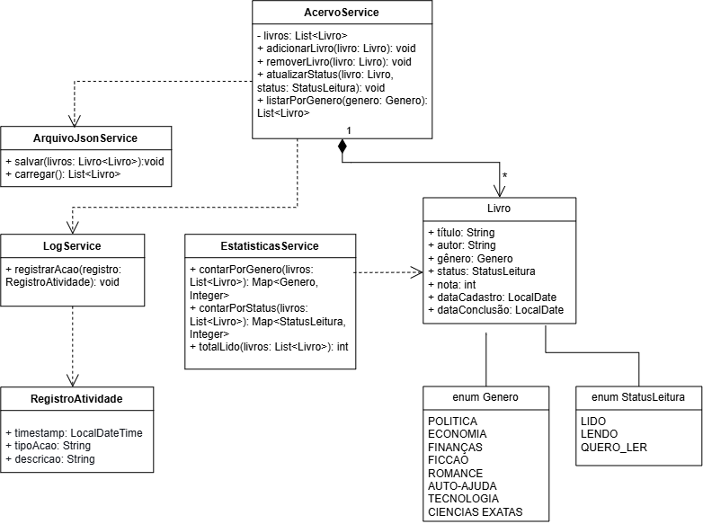

# 📚 Meu Acervo de Leitura

Sistema pessoal para cadastro e acompanhamento dos livros que já li, estou lendo ou pretendo ler. Gera estatísticas de leitura por gênero e status, além de um log de atividades a cada ação realizada.

## 🎯 Objetivo

Diferente de um sistema de biblioteca tradicional (empréstimo/devolução para terceiros), este projeto é focado no **controle pessoal de leitura**, permitindo:

- Cadastrar livros com título, autor, gênero e status
- Marcar livros como lidos, atualizando estatísticas automaticamente
- Visualizar quantos livros já foram lidos, por gênero
- Gerar um log automático de todas as ações realizadas

## 🚀 Funcionalidades

- [x] Cadastro de livros
- [x] Classificação por gênero (Ficção, Romance, Política, etc.)
- [x] Controle de status (Lido / Quero Ler / Lendo)
- [x] Estatísticas de leitura
- [x] Log de atividades em arquivo de texto
- [x] Persistência de dados em JSON
- [ ] API REST
- [ ] Dashboard front-end

## 🛠️ Tecnologias

- Java (POO, estruturas de dados)
- HTML, CSS e JavaScript (front-end)
- JSON (persistência de dados)

## 📁 Estrutura do Projeto

\`\`\`
meu-acervo-de-leitura/
├── src/
│   ├── model/
│   ├── service/
│   ├── persistence/
│   └── Main.java
├── frontend/
│   ├── index.html
│   ├── style.css
│   └── script.js
├── docs/
│   └── diagrama-uml.png
├── data/
│   └── livros.json
├── logs/
│   └── log.txt
├── .gitignore
└── README.md
\`\`\`

## 📐 Diagrama UML

## ▶️ Como executar

\`\`\`bash
# Clone o repositório
git clone git@github.com:lincolnmeira/Meu-Acervo-de-Leitura.git

# Entre na pasta
cd meu-acervo-de-leitura

# Compile e execute (ajuste conforme sua configuração)
javac src/Main.java -d bin
java -cp bin Main
\`\`\`

## 📸 Prints

*(adicionar screenshots do dashboard aqui quando estiver pronto)*

## 📝 Licença

Este projeto é de uso livre para fins de estudo e portfólio.